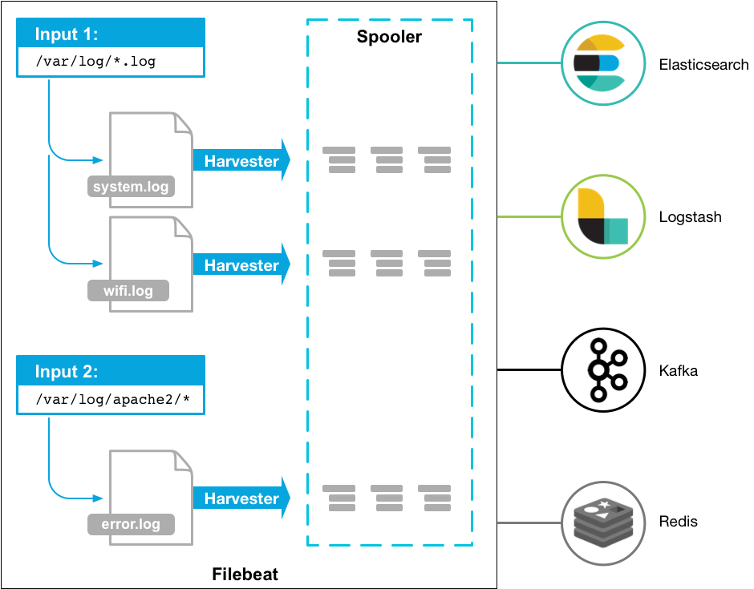

# ELK简介
Elasticsearch：分布式搜索引擎。具有高可伸缩、高可靠、易管理等特点，可用于全文检索、结构化检索和分析，并能将这三者结合起来。Elasticsearch 使用Java 基于 Lucene 开发，是现在使用最广的开源搜索引擎之一，Wikipedia 、StackOverflow、Github 等都基于它来构建的。
Logstash：数据收集处理引擎。支持动态的从各种数据源搜集数据，并对数据进行过滤、分析、丰富、统一格式等操作，然后存储以供后续使用。
Kibana：可视化化平台。它能够搜索、展示存储在 Elasticsearch 中索引数据。使用它可以很方便的用图表、表格、地图展示和分析数据。

当然，除了ELK，行业内还有一些轻量型数据采集方案，比如Beats、Loki。
Filebeat：轻量级数据收集引擎。相对于Logstash所占用的系统资源来说，Filebeat 所占用的系统资源几乎是微乎及微。它是基于原先 Logstash-fowarder 的源码改造出来。换句话说：Filebeat就是新版的 Logstash-fowarder，也会是 ELK Stack 在 Agent 的第一选择。
# ELK常见架构
* Elasticsearch + Logstash + Kibana：这种架构，通过Logstash收集日志，Elasticsearch分析日志，然后在Kibana中展示数据。这种架构虽然是官网介绍里的方式，但是在生产中却很少使用。
* Elasticsearch + Logstash + filebeat + Kibana：与上一种架构相比，增加了一个filebeat模块。filebeat是一个轻量的日志收集代理，用来部署在客户端，优势是消耗非常少的资源(较logstash)就能够收集到日志。所以在生产中，往往会采取这种架构方式，但是这种架构有一个缺点，当logstash出现故障， 会造成日志的丢失。
* Elasticsearch + Logstash + filebeat + redis + Kibana：此种架构是上面架构的完善版，通过增加中间件，来避免数据的丢失。当Logstash出现故障，日志还是存在中间件中，当Logstash再次启动，则会读取中间件中积压的日志。

# 在Docker环境下部署 Elasticsearch 可视化工具
## 什么是Elasticsearch？
ElasticStack简称为ES， 是一个分布式、高扩展、高实时的搜索与数据分析引擎，是整个ELK架构的核心。
它能很方便的使大量数据具有搜索、分析和探索的能力。充分利用Elasticsearch的水平伸缩性，能使数据在生产环境变得更有价值。
Elasticsearch 的实现原理主要分为以下几个步骤，首先用户将数据提交到Elasticsearch 数据库中，再通过分词控制器去将对应的语句分词，将其权重和分词结果一并存入数据，当用户搜索数据时候，再根据权重将结果排名，打分，再将返回结果呈现给用户。

## 主要优点
* 处理方式灵活： elasticsearch是实时全文索引，具有强大的搜索功能；
* 配置相对简单： elasticsearch全部使用JSON接口，logstash使用模块配置，kibana的配置文件部分更简单；
* 检索性能高效： 基于优秀的设计，虽然每次查询都是实时，但是也可以达到百亿级数据的查询秒级响应；
* 集群线性扩展： elasticsearch和logstash都可以灵活线性扩展。

## 常用场景

- 全文搜索
Elasticsearch提供了全文搜索的功能，适用于电商商品搜索、App搜索、企业内部信息搜索、IT系统搜索等。

- 日志分析
Elasticsearch能够借助Beats、Logstash等快速对接各种常见的数据源，并通过集成的Kibana高效地完成日志的可视化分析，让日志产生价值。

- 运维监控
使用Elasticsearch结合Beats、Logstash或ElasticFlow将所有日志实时集中并构建索引，然后通过集成的Kibana灵活地运用数据构建可视化运维看板

- 安全分析
通过日志解决公司内部繁杂的安全审计工作，可通过Elasticsearch分析、检索海量历史日志，高效地完成安全审计工作

## 部署Elasticsearch

1.拉取镜像

    docker pull elasticsearch:8.6.2
2.创建宿主机挂载目录

    mkdir -p e:/elk/es/data 
    mkdir -p e:/elk/es/config 
    mkdir -p e:/elk/es/logs
    mkdir -p e:/elk/es/plugins
3.创建es配置文件 
    
    touch e:/elk/es/config/elasticsearch.yml
    echo "http.host: 0.0.0.0" >> e:/elk/es/config/elasticsearch.yml #监听的地址，可以外网访问
    echo "xpack.monitoring.collection.enabled: true" >> e:/elk/es/config/elasticsearch.yml # 添加这个配置以后在kibana中才会显示联机状态，否则会显示脱机状态
    echo "xpack.security.enabled: false" >> e:/elk/es/config/elasticsearch.yml # 添加这个配置无需用户名密码访问
    docker network create -d bridge es-net ## 创建docker es网络

3.启动elasticsearch镜像

    docker run -d -p 9200:9200 -p 9300:9300 --network es-net --restart=always --name es -e "discovery.type=single-node" -e ES_JAVA_OPTS="-Xms512m -Xmx512m" -v e:/elk/es/data:/usr/share/elasticsearch/data/elasticsearch.yml -v e:/elk/es/config/elasticsearch.yml:/usr/share/elasticsearch/config/elasticsearch.yml -v e:/elk/es/logs:/usr/share/elasticsearch/logs -v e:/elk/es/plugins:/usr/share/elasticsearch/plugins --privileged elasticsearch:8.6.2
> 命令解释
* -e "cluster.name=es-docker-cluster"：设置集群名称
* -e "http.host=0.0.0.0"：监听的地址，可以外网访问
* -e "ES_JAVA_OPTS=-Xms512m -Xmx512m"：内存大小
* -e "discovery.type=single-node"：非集群模式
* -v e:/elk/es/data:/usr/share/elasticsearch/data：挂载逻辑卷，绑定es的数据目录
* -v e:/elk/es/config/elasticsearch.yml:/usr/share/elasticsearch/config/elasticsearch.yml：挂载逻辑卷，绑定es的配置文件
* -v e:/elk/es/logs:/usr/share/elasticsearch/logs：挂载逻辑卷，绑定es的日志目录
* -v e:/elk/es/plugins:/usr/share/elasticsearch/plugins：挂载逻辑卷，绑定es的插件目录
* --privileged：授予逻辑卷访问权
* -p 9200:9200 -p 9300:9300：端口映射配置
* --network es-net ：加入一个名为es-net的网络中
* --restart=always  Docker 重启时，容器自动启动。

# 在Docker环境下部署 logstash

## 什么是 logstash？
logstash数据收集处理引擎。支持动态的从各种数据源搜集数据，并对数据进行过滤、分析、丰富、统一格式等操作，然后存储以供后续使用。

## 工作方式
管道（Logstash Pipeline）是Logstash中独立的运行单元，每个管道都包含两个必须的元素输入（input）和输出（output），和一个可选的元素过滤器（filter），事件处理管道负责协调它们的执行。
输入和输出支持编解码器，使您可以在数据进入或退出管道时对其进行编码或解码，而不必使用单独的过滤器。如：json、multiline等

> inputs（输入阶段）

Logstash 支持各种输入选择，可以同时从众多常用来源捕捉事件。
包括：file、kafka、beats等
> inputs（输入阶段）：

Logstash 支持各种输入选择，可以同时从众多常用来源捕捉事件。
包括：file、kafka、beats等
> filters（筛选阶段）：

数据从源传输到存储库的过程中，Logstash 筛选器能够解析各个事件，识别已命名的字段以构建结构，并将它们转换成通用格式，以便进行更强大的分析和实现商业价值。
包括：

利用 Grok 从非结构化数据中派生出结构
简化整体处理，不受数据源、格式或架构的影响等

> outputs（输出阶段）：

将事件数据发送到特定的目的地，完成了所以输出处理，改事件就完成了执行。
如：elasticsearch、file、redis等

> Codecs（解码器）：

基本上是流过滤器，作为输入和输出的一部分进行操作，可以轻松地将消息的传输与序列化过程分开。

## 部署logstash 
1.拉取镜像   

    docker pull logstash:8.6.2
2.创建宿主机挂载目录

    mkdir -p e:/elk/logstash/config
    mkdir -p e:/elk/logstash/pipeline

3.创建配置文件
    
    1.配置logstash.yml
        logstash.yml 放在e:/elk/logstash/config
        touch logstash.yml
        vi logstash.yml
        config:
            reload:
                automatic: true
                interval: 3s
        xpack:
            management.enabled: false
            monitoring.enabled: false
    2.配置文件 pipelines.yml
        pipelines.yml 放在e:/elk/logstash/config
        在这里我们可以配置多个管道信息，来收集不同的信息
        touch pipelines.yml
        vi pipelines.yml

        - pipeline.id: logstash_dev
        path.config: /usr/share/logstash/pipeline/logstash_dev.conf

        配置文件 logstash_dev.conf 放在e:/elk/logstash/pipeline下，注意使用空格，不要使用 Tab
        touch logstash_dev.conf
        vi logstash_dev.conf
        
        input {
            beats {
                #5044端口是logstash启动的tcp监听端口
                port => 5044
            }
        }
        
        filter {
            grok {
                match => { "message" => "%{COMBINEDAPACHELOG}" }
            }
        
            mutate {
                convert => {
                    "bytes" => "integer"
                }
            }
        
            geoip {
                source => "clientip"
                target => "clientgeo"
            }
        
            useragent {
                source => "user_agent"
                target => "useragent"
            }
        
            date {
                match => ["timestamp", "dd/MMM/yyyy:HH:mm:ss Z"]
            }
        }
        
        output {
            stdout { }
            elasticsearch {
                hosts => ["10.62.31.216:9200"]
                index => "example"
            }
        }
4.启动容器
    
    docker run -d -it --restart=always  --privileged=true  --name=logstash -p 5044:5044 -p 9600:9600 -v e:/elk/logstash/pipeline:/usr/share/logstash/pipeline/      -v e:/elk/logstash/config:/usr/share/logstash/config/ logstash:8.6.2

# 在Docker环境下部署 kibana

## 什么是 Kibana？
Kibana是一个开源的分析与可视化平台，设计出来用于和Elasticsearch一起使用的。
你可以用kibana搜索、查看存放在Elasticsearch中的数据。Kibana与Elasticsearch的交互方式是各种不同的图表、表格、地图等，直观的展示数据，从而达到高级的数据分析与可视化的目的。

# 部署 Kibana 可视化工具
## 拉取镜像

    docker pull kibana:8.6.2

## 创建kibana配置文件

    mkdir e:/elk/kibana/
    touch e:/elk/kibana/kibana.yml

## 配置kibana.yml

    #
    # ** THIS IS AN AUTO-GENERATED FILE **
    #
    
    # Default Kibana configuration for docker target
    server.name: kibana
    server.host: "0.0.0.0"
    server.shutdownTimeout: "5s"
    # es宿主机访问地址
    elasticsearch.hosts: [ "http://10.62.31.216:9200" ]
    xpack.monitoring.ui.container.elasticsearch.enabled: true
    # 配置中文显示
    i18n.locale: "zh-CN"

## 部署Kibana
    
    docker run -d --restart=always --log-driver json-file --log-opt max-size=500m --log-opt max-file=2 --name kibana -p 5601:5601 -v e:/elk/kibana/kibana.yml:/usr/share/kibana/config/kibana.yml kibana:8.6.2

# 在Docker环境下部署 Filebeat
## 什么是Filebeat
轻量级数据收集引擎。相对于Logstash所占用的系统资源来说，Filebeat 所占用的系统资源几乎是微乎及微。它是基于原先 Logstash-fowarder 的源码改造出来。换句话说：Filebeat就是新版的 Logstash-fowarder，也会是 ELK Stack 在 Agent 的第一选择。

## Filebeat工作流程
Filebeat主要包含两个组件：输入和收割机，这些组件协同工作将文件尾部最新事件数据发送到指定的输出

- 输入（input）：负责管理收割机从哪个路径查找所有可读取的资源
- 收割机（Harvester）：负责逐行读取单个文件的内容，然后将内容发送到输出

## 拉取镜像
    docker run elastic/filebeat:8.6.2

## 创建filebeat配置文件

    mkdir e:/elk/filebeat/
    touch e:/elk/filebeat/filebeat.yml
## ## 配置kibana.yml

    #filebeat默认值为auto，创建的elasticsearch索引生命周期为50GB+30天。如果不改，可以不用设置
    #从7.0版本开始，索引生命周期管理（ILM）默认是开启状态，当开启状态时候，setup.template.name和
    #setup.template.pattern两个参数不生效，所以还需要配置关闭ILM，即setup.ilm.enabled: false
    setup.ilm.enabled: false
    # # 生成index模板的名称
    setup.template.name: "chenjw-log"
    # # 生成index模板匹配的index格式
    setup.template.pattern: "chenjw-*"

    ## 模板设置
    setup.template.settings:
      #主分片数，默认为1
      index.number_of_shards: 5
      # 副本分片数，默认为1
      index.number_of_replicas: 0
      # index数据存储的编码方式（压缩方式）
      index.codec: best_compression

    filebeat.inputs:
      - type: log				##文本日志
      # 标签过滤的时候可以使用,这里用项目名
      tags: ["mideadc"]
      # 需要收集的日志所在的位置，可使用通配符进行配置
      paths:
        - /elk/logs/*/*.log

    output.elasticsearch:  			#输出到elasticsearch，也可以输出到logstash
      hosts: ["10.62.31.216:9200"] 	#elasticsearch地址,
      index: "filebeat-%{+yyyy.MM.dd}"

    #日志输出配置(采用 logstash 收集日志，5044为logstash端口) 注意：Logstash和Elasticsearch选择一个作为日志输出即可，不能同时选择
    #output.logstash:
    #  hosts: ['10.62.31.216:5044']

## 启动Filebeat

                                                                                            docker run -d --name filebeat --restart=always -e TZ=Asia/Shanghai -v e:/elk/filebeat/filebeat.yml:/usr/share/filebeat/filebeat.yml -v e:/IdeaProject/置业云/置业云后台/logs:/elk/logs/ elastic/filebeat:8.6.2

## ELK使用教程